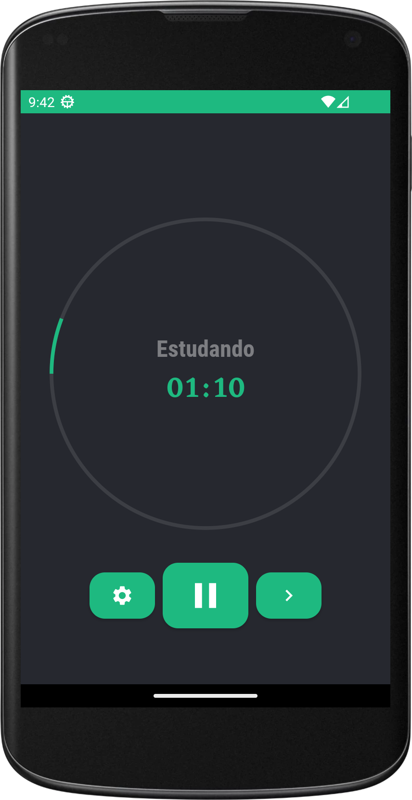
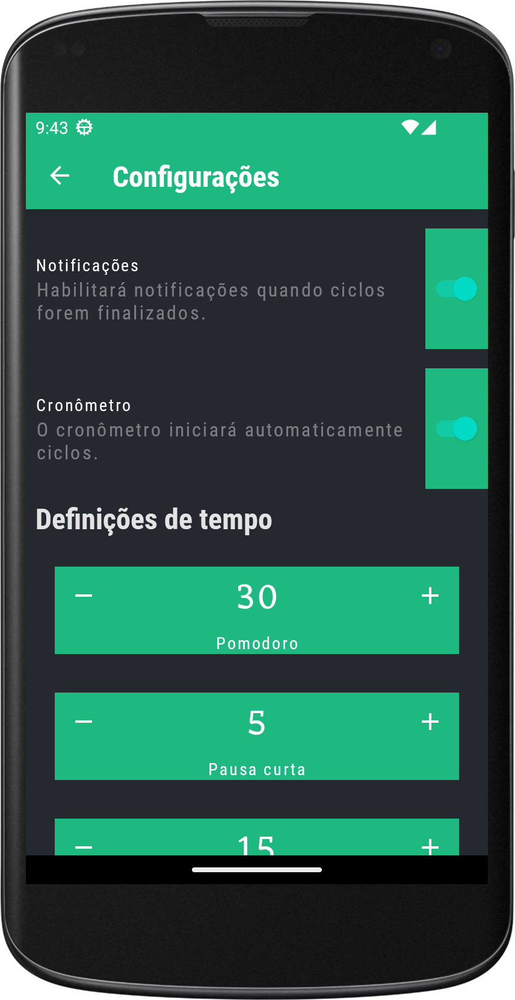
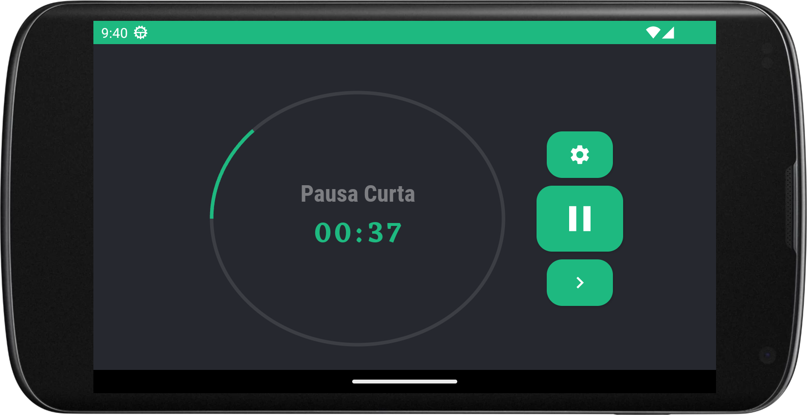
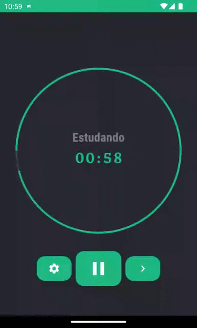

<h1 align="center">ESTUDIA - POMODORO PARA ESTUDOS</h1>

<p align="center">
  <a href="https://opensource.org/licenses/Apache-2.0"></a>
  <a href="https://opensource.org/licenses/Apache-2.0"></a>
  <br>
  <a href="https://wa.me/+5524981213029">     </a>
  <a href="https://www.linkedin.com/in/andr%C3%A9-esperan%C3%A7a/"></a>
  <a href="mailto:andreluizesperancacorreia@gmail.com"></a>
</p>

<p align="center">  

⭐ Esse é um projeto para demonstrar meu conhecimento técnico no desenvolvimento Android nativo com Kotlin. Mais informações técnicas abaixo.

Aplicativo que permite utilizar o método Pomodoro focado para estudos. Feito com Jetpack Compose com temporizador de preenchimento, notificações e tempo configuráveis.

</p>

</br>
<p float="left" align="center">


</p>

</br>
<p float="left" align="center">

</p>


## Download
BADGE DA PLAYSTORE https://play.google.com/intl/en_us/badges/

Ou faça o download da <a href="apk/app-debug.apk?raw=true">APK diretamente</a>. Você pode ver <a href="https://www.google.com/search?q=como+instalar+um+apk+no+android">aqui</a> como instalar uma APK no seu aparelho android.

## Tecnologias usadas e bibliotecas de código aberto

- Minimum SDK level 21
- [Linguagem Kotlin](https://kotlinlang.org/)

- Jetpack 
  - Compose: Para escrever a UI de maneira programática com funções de composição que descrevem a forma e as dependências de dados dela. 
  - Lifecycle: Observe os ciclos de vida do Android e manipule os estados da interface do usuário após as alterações do ciclo de vida.
  - ViewModel: Gerencia o detentor de dados relacionados à interface do usuário e o ciclo de vida. Permite que os dados sobrevivam a alterações de configuração, como rotações de tela.
  - Custom Views: View customizadas feitas do zero usando Jetpack Compose.
  - Hilt: Para injeção de dependências que reduz o código boilerplate criado por injeções manuais no projeto.

- Arquitetura 
  - MVVM (Model - View - View-Model)
  - Comunicação da ViewModel com a View através de State Flow
  - Comunicação da ViewModel com a Model através de Kotlin Flow
  - Repositories para abstração da comunidação com a camada de dados.
  - Interfaces que são implementadas nos Repositories para facilitar os testes unitários.
  
## Arquitetura
**Estudia** utiliza a arquitetura MVVM e o padrão de Repositories, que segue as [recomendações oficiais do Google](https://developer.android.com/topic/architecture).
</br></br>


<br>

## Features

### Iniciar/Pausar


Pausar e iniciar o temporizador.

### Notificações


Notificações ao finalizar ciclos.

### Trocar de estados manualmente


Pode trocar também entre estados manualmente.

### Trocar configurações


Escolher entre usar ou não notificações e temporizador que iniciará ciclos automáticamente.

### Trocar definições de tempo


Trocar difições de duração de cilos de estudo, pausa e pausa longa.

### Pausas curtas


Após um ciclo de estudo você terá uma pausa curta.

### Pausas longas


Após quatro ciclos de estudo consecutivos você terá uma pausa longa.

# Licença
```xml

   Copyright [2023] [André Luiz Esperança Correia]

   Licensed under the Apache License, Version 2.0 (the "License");
   you may not use this file except in compliance with the License.
   You may obtain a copy of the License at

     http://www.apache.org/licenses/LICENSE-2.0

   Unless required by applicable law or agreed to in writing, software
   distributed under the License is distributed on an "AS IS" BASIS,
   WITHOUT WARRANTIES OR CONDITIONS OF ANY KIND, either express or implied.
   See the License for the specific language governing permissions and
   limitations under the License.

```
